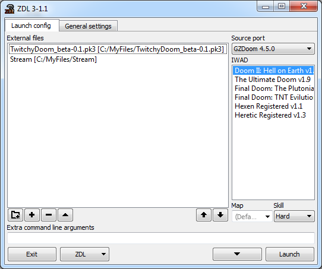
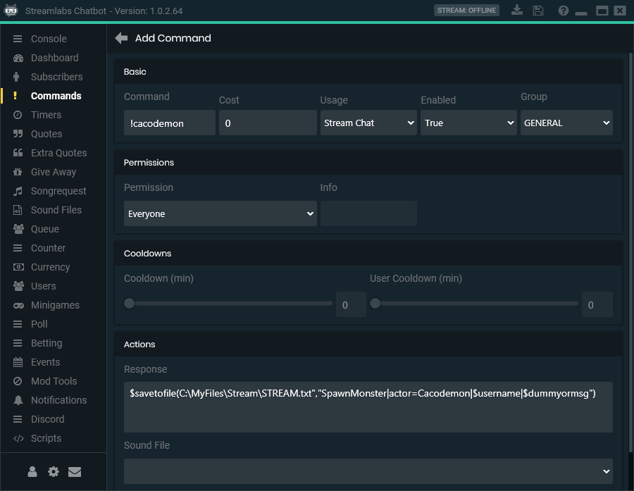

# TwitchyDoom

TwitchyDoom is a mod for GZDoom that allows Streamlabs Chatbot users to create commands that interact with GZDoom, allowing viewers to interact with their streams.

# Installation

First, you must have Streamlabs Chatbot (free) installed and have a working chatbot linked to your main Twitch.tv account. There are many installation guides and videos on this, but here's the official one: https://cdn.streamlabs.com/chatbot/Documentation_Twitch.pdf

Next, you will need a directory on your computer with a single file in it called STREAM.txt. This file will be written to by the chatbot, and read by GZDoom. You do not need to touch this file after creating it. GZdoom will read the entire directory so don't put any other files in this folder.

Finally, your GZDoom launcher should add this folder to its list of external files (For example: ZDL has a folder+ button), along with the TwitchyDoom pk3 file. You're now ready to begin customizing the bot.

Here's an example launching with [ZDL](https://zdoom.org/wiki/ZDL):



To confirm everything is set up, boot up GZDoom. You should see a message confirming the game is working. If you don't get a message, TwitchyDoom pk3 is missing. If you get an error, your launcher is not pointing to the STREAM.txt folder correctly.

# Adding Commands

To add a command that works with TwitchyDoom, first click the Add Command button in the Streamlabs Chatbot client. You can name the command whatever you like, and alter the costs and cooldowns etc as you please. The important part is the Response field. This needs to contain the following data:

```
$savetofile("FILEPATH","COMMAND|PARAMETERS|$username|$dummyormsg")
```

`FILEPATH` must be replaced with the path to your STREAM.txt. For example, if you placed it in C:\MyFiles\Stream\, you would replace `FILEPATH` with `C:\MyFiles\Stream\STREAM.txt`

`COMMAND` is the TwitchyDoom command you wish to execute when this command is called by a viewer. See the [list of commands](#command-list) below. If you wanted to use the SpawnMonster command, you would replace `COMMAND` with `SpawnMonster`

`PARAMETERS` are any paramaters the TwitchyDoom command you've chosen supports. Parameters are seperated by a comma (no spaces) and each command has specific parameters you can use. Using the same example of SpawnMonster, the command requires an `Actor` parameter to function. If you wanted this command to spawn an Archvile, you would replace `PARAMETERS` with `Actor=Archvile`. See each command's page to find their parameters and what they do.

Note: If you do not wish to declare any parameters or the command does not use them, you must still include all three |'s in the response. I.e SpawnMonster||$username|$dummyormsg

$username and $dummyormsg should be left alone. These retrieve the username and text sent by the viewer.

Here's an example of what response field should look like (assuming your STREAM.txt is in C:\MyFiles\Stream\):

```
$savetofile("C:\MyFiles\Stream\STREAM.txt","SpawnItem|Actor=Medikit|$username|$dummyormsg")
```
Which would trigger the SpawnItem TwitchyDoom command, spawning a Medikit near the player.

Here's an example image of a command that spawns a Cacodemon:



Note that you can test your commands even when your stream is offline.

# Command List

<!-- inter-toc commands -->

* [GiveItem](commands/GiveItem.md)
* [SpawnItem](commands/SpawnItem.md)
* [SpawnMonster](commands/SpawnMonster.md)
* [SpawnFriendlyMonster](commands/SpawnFriendlyMonster.md)
* [SpawnOnPlayer](commands/SpawnOnPlayer.md)
* [MassResurrect](commands/MassResurrect.md)
* [GiveMonsterItem](commands/GiveMonsterItem.md)
* [MonsterSound](commands/MonsterSound.md)
* [ChangeMusic](commands/ChangeMusic.md)
* [Log](commands/Log.md)

<!-- end -->

# Global Parameters

These parameters can be used with all commands.

`Delay=x` Delays the command by x seconds. Notification messages are sent first, so this is useful if you want to give the player a warning before the command is executed.

`NoNotify=true` - Removes any messsages sent to the player from the command, if the command usually sends any.

`NoName=true` - Removes the username from any actors spawned via the command that would display them usually.

# Creating new Command classes

TODO

<!-- EOF -->
