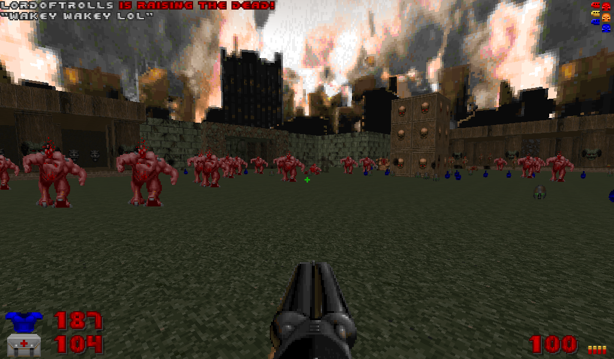

# MassResurrect

Resurrects dead monsters near the player. A message is displayed when this happens, telling the player who caused the resurrection. If the user provides a message after the command, it is also displayed.

## Parameters
```
Radius - The radius of the resurrection circle (Default 600).
```

`Radius` is in map units the size of the resurrection. If unspecified or 0, it will use the default value.

## Examples

```
$savetofile("C:\MyFiles\Stream\STREAM.txt","MassResurrect||$username|$dummyormsg")
```
Resurrects monsters near the player immediately.

```
$savetofile("C:\MyFiles\Stream\STREAM.txt","MassResurrect|Radius=10000,Delay=5|$username|$dummyormsg")
```
Resurrects monsters in a massive radius after 5 seconds.

## Screenshots


