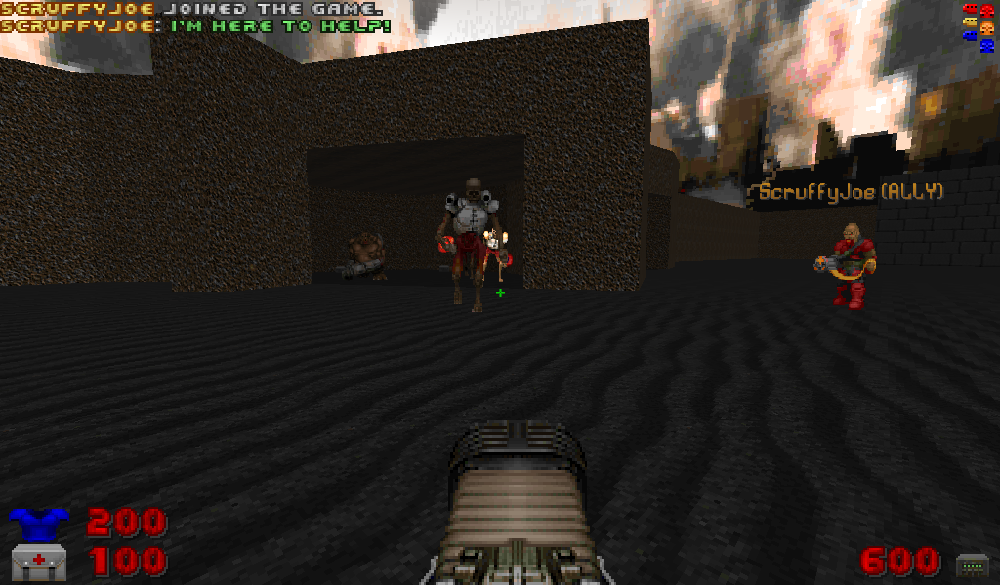

# SpawnFriendlyMonster

Spawns a friendly version of the specified monster next to the player, which will help the player fight other monsters. The monster has the username of the person who sent the command will appear above it as long as it is in the players's line of sight. If the player goes too far away from the friendly monster, they will spawn near the player after a short time.

## Parameters
```
Actor - The actor to spawn.
NoFollow=true - The actor will not teleport to the player if they are too far away.
ShowMap=true - The actor will be shown on the automap.
```

`Actor` should be a valid Actor class. If the monster class is invalid, it will choose a random monster from the existing pool of monsters.
If the class is a RandomSpawner, it will choose a monster from the result of that RandomSpawner.

## Examples

```
$savetofile("C:\MyFiles\Stream\STREAM.txt","SpawnFriendlyMonster|Actor=DoomImp|$username|$dummyormsg")
```
Spawns a friendly imp near the player.

```
$savetofile("C:\MyFiles\Stream\STREAM.txt","SpawnFriendlyMonster|Actor=BaronOfHell,NoName=true|$username|$dummyormsg")
```
Spawns a friendly Baron of Hell near the player without the username.

## Screenshots


