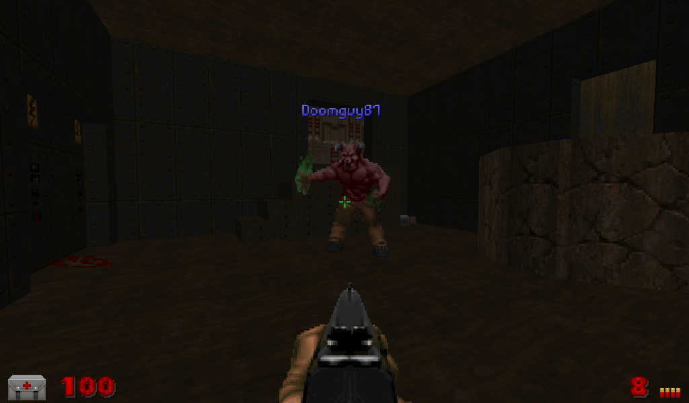

# SpawnMonster

Spawns a monster in the world, outside of the Player's line of sight, which immediately starts hunting the player. The monster has the username of the person who sent the command will appear above it as long as it is in the players's line of sight.

## Parameters
```
Actor - The actor to spawn.
Distance - The minimum distance away from the player (in 128 map units) in order for the Actor to spawn. Default is 1.
Distance=Random - Use a random distance.
Effect - The effect actor to spawn when the Actor is spawned.
NoLOS=true - Spawn the actor even if a player is in line of sight.
ShowMap=true - The actor will be shown on the automap.
```

`Actor` should be a valid Actor class. If the monster class is invalid, it will choose a random monster from the existing pool of monsters.
If the class is a RandomSpawner, it will choose a monster from the result of that RandomSpawner.

`Distance` changes how far away the actor must be from a player in order to spawn. The value is multiplied by 128 map units. If you specify a value of 3, it will try to spawn the actor at least 384 map units away. If it cannot find a safe location at this distance it will try one closer to the player. Specifying Random will pick a random value between 1 and 50.

## Examples

```
$savetofile("C:\MyFiles\Stream\STREAM.txt","SpawnMonster|Actor=Archvile|$username|$dummyormsg")
```
Spawns an Archvile near the player.

```
$savetofile("C:\MyFiles\Stream\STREAM.txt","SpawnMonster|Actor=Fatso,NoName=true|$username|$dummyormsg")
```
Spawns a Mancubus near the player without the username.

## Screenshots


